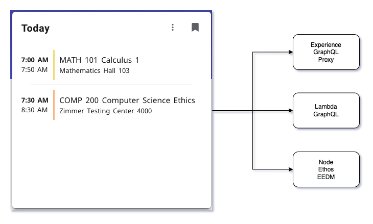

# Experience Ethos Examples

## Today's Classes Examples
This set of example projects is driven by the use case of having a card that displays the user's classes that meet today. This includes an Experience extension with three cards. Each card displays the same information using a different means of fetching the data through Ethos Integration. This example includes using Experience's GraphQL Proxy, a Lambda microservice using Ethos GraphQL, and a node microservice using Ethos EEDM (Ellucian Education Domain Model).

These examples are details here: [today-classes](docs/today-classes.md)

## Account Details Examples
This set of example projects includes an Experience extension with a card and page that shows the user's account balance and transactions. This example uses BP API (Banner Business Process API) through Ethos Integration to retrieve the Account Details. The authorization and fetching of the data from BP API is done with a Lambda microservice

These examples are detailed here: [account-details](docs/account-details.md)

Copyright 2021–2022 Ellucian Company L.P. and its affiliates.
