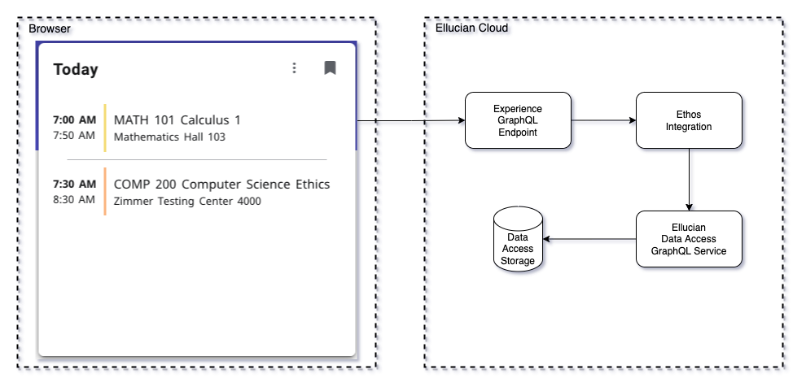

  # Experience Ethos Examples

1. [Account Detail](#account-details-example)
1. [Account Detail Data Connect](#account-details-data-connect-example)
1. [API Dashboard](#api-dashboard-example)
1. [Instructor Classes Lambda](#instructor-classes-lambda-example)
1. [Leave Balance](#leave-balance-example)
1. [Leave Balance Data Connect](#leave-balance-data-connect-example)
1. [Today Classes GraphQL Proxy](#todays-classes-graphql-proxy-example)
1. [Today Classes Lambda](#todays-classes-lambda-example)
1. [Today Classes Node](#todays-classes-node-example)

## Account Details Example
This example includes a card and page that show the current user their account details and balance. There are two npm projects in this example, an extension, and a microservice. The data for the card and page are acquired through the BP API (Banner Business Process API) through Ethos Integration. Additional data and behavior could include using a Pay Now feature that integrates with your payment provider.

This example is detailed here: [account-details](account-details/README.md)

 

 

## Account Details Data Connect Example
This example includes a card and page that show the current user their account details and balance. There are two directories in this example, an extension, and dataconnect. The data for the card and page are acquired using Data Connect's Serverless API. The Data Connect Serverless API pipeline calls a BP API (Banner Business Process API) through Ethos Integration. Additional data and behavior could include using a Pay Now feature that integrates with your payment provider.

Note: Using Data Connect Serverless API allows the extension code in the browser to directly make the API call to Ethos without the need for a microservice. The browser user's identity is used to restrict the execution of the DC pipeline API through Data Connect permissions. The API Key used in the pipeline is configured in the card *server configuration* to protect it from the browser.

*Please note that Data Connect Serverless APIs are currently in Select and not Generally Available. If you'd like to get involved, check out this community post in the [Ellucian Community](https://elluciansupport.service-now.com/esc?id=community_blog&sys_id=119fdfd1876035946fd864ed0ebb350f&view_source=featuredList)

This example is detailed here: [account-details-dataconnect](account-details-dataconnect/README.md)

 

 

## API Dashboard Example
This example includes a card that can be used to observe the other examples of API requests. This simple card is to allow you to do simple comparisons of the various examples by capturing API request times.

This example is detailed here: [api-dashboard](api-dashboard/extension/README.md)

 

 

## Instructor Classes Lambda Example
This example includes a card that shows an instructor's classes. There are two npm projects in this example, an extension, and a microservice. The data for the card is acquired through the Ethos GraphQL utilizing the same resources as the Today Classes examples.

This example is detailed here: [instructor-classes-lambda](instructor-classes-lambda/README.md)

 

 

## Leave Balance Example
This example includes a card and page that show the current user, an employee their leave balance. There are two npm projects in this example, an extension, and a microservice. The data for the card and page are acquired through the BP API (Banner Business Process API) through Ethos Integration.

This example is detailed here: [leave-balance](leave-balance/README.md)

 

 

## Leave Balance Data Connect Example
This example includes a card and page that show the current user, an employee their leave balance. There are two directories in this example, an extension, and dataconnect. The data for the card and page are acquired using Data Connect's Serverless API. The Data Connect Serverless API pipeline calls a BP API (Banner Business Process API) through Ethos Integration.

Note: Using Data Connect Serverless API allows the extension code in the browser to directly make the API call to Ethos without the need for a microservice. The browser user's identity is used to restrict the execution of the DC pipeline API through Data Connect permissions. The API Key used in the pipeline is configured in the card *server configuration* to protect it from the browser.

*Please note that Data Connect Serverless APIs are currently in Select and not Generally Available. If you'd like to get involved, check out this community post in the [Ellucian Community](https://elluciansupport.service-now.com/esc?id=community_blog&sys_id=119fdfd1876035946fd864ed0ebb350f&view_source=featuredList)

This example is detailed here: [leave-balance-dataconnect](leave-balance-dataconnect/README.md)

 

 

## Today's Classes GraphQL Proxy Example
This example is part of a suite of examples that illustrate multiple methods to access institution data through Ethos from Experience cards and pages. The use case is a card that displays the student's classes that meet today. This example fetches the Ethos data utilizing the Experience GraphQL proxy. Using Experience's GraphQL proxy avoids the need to deploy a microservice. The efficiency of GraphQL also reduces the round trips to Ethos by returning graphs of objects. There is some extra setup effort involved in loading the needed resources into Ellucian Data Access and authorizing the Ethos Application to use those resources.

This example is detailed here: [today-classes-graphql](today-classes-graphql/README.md)

 

 

## Today's Classes Lambda Example
This example is part of a suite of examples that illustrate multiple methods to access institution data through Ethos from Experience cards and pages. The use case is a card that displays the student's classes that meet today. This example fetches the Ethos data through a Lambda microservice that utilizes Ethos GraphQL. The efficiency of GraphQL also reduces the round trips to Ethos by returning graphs of objects. Using Lambda provides a reduced effort deployment of the microservice endpoints. There is some extra setup effort involved in loading the needed resources into Ellucian Data Access and authorizing the Ethos Application to use those resources.

This example is detailed here: [today-classes-lambda](today-classes-lambda/README.md)

 

 

## Today's Classes Node Example
This example is part of a suite of examples that illustrate multiple methods to access institution data through Ethos from Experience cards and pages. The use case is a card that displays the student's classes that meet today. This example fetches the Ethos data through a Node microservice which retrieves the data using Ethos EEDM resources (Ellucian Ethos Data Model). Accessing the Ethos EEDM resources reduces the setup effort over using GraphQL. Note, this node application will need to be deployed in a scalable manner.

This example is detailed here: [today-classes-node](today-classes-node/README.md)

 

 

Copyright 2021–2023 Ellucian Company L.P. and its affiliates.

  
