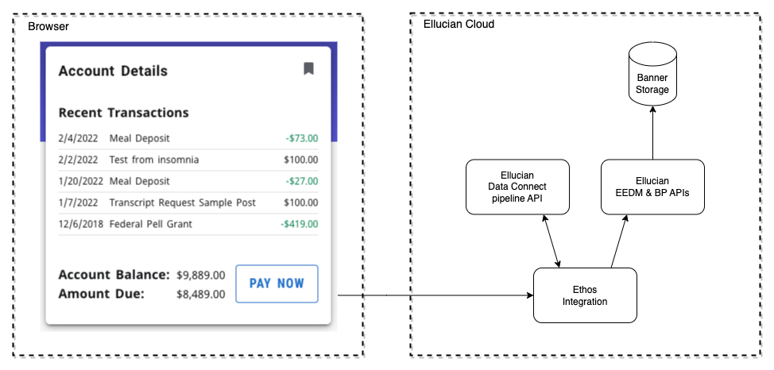

# Experience Ethos Example - Account Details Data Connect

This example includes a card and page that show the current user their account details and balance. There are two top level directories for this example. The extension and dataconnect.
Additional data and behavior could include using a Pay Now feature that integrates with your payment provider.

The architecture of the Experience extension is as diagramed.

## Account Details Extension

This extension includes a card that displays the five most recent transactions on the current user's account. Clicking on the card will open a page that displays all their transactions with more details.

For details regarding the extension see: [readme](extension/README.md)

## Data Connect API

The dataconnect directory includes an exported Data Connect API pipeline and a readme. The dataconnect pipeline makes a call to EEDM persons API and BP API account-detail-reviews through Ethos Integration.

For details regarding the Data Connect API see: [readme](dataconnect/README.md)

Copyright 2021–2023 Ellucian Company L.P. and its affiliates.
