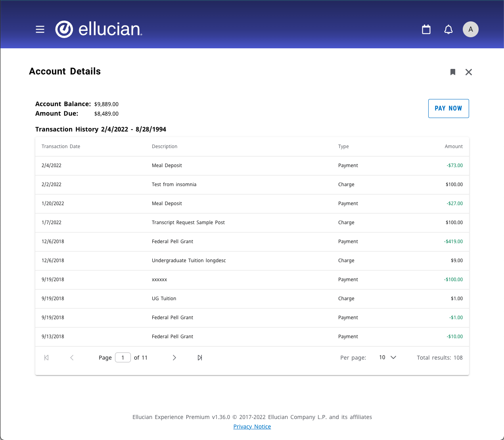

# Account Details Extension
## The Extension
This example extension includes a card and page that show the current user their account details and balance. This example provides a starting point for other functionality. Additional data and behavior could include using a Pay Now feature that integrates with your payment provider.

The interaction between the Experience card and page with Ethos is as diagramed.

 

To upload and use this extension you will need to do the following from the account-details/extension directory:

### Upload the extension

1. Run 'npm install'
1. Set the "publisher" in extension.js. This should be the name of your institution or organization.
1. Copy sample.env to .env. Adding your upload token and uncommenting and editing the other vars as appropriate.
1. Run one of the deploy scripts in package.json. Such as "watch-and-upload" or "deploy-dev".
1. Use Experience Setup to enable or verify your new extension is enabled, is associated with an Environment, has a shared secret, and, has an Extension API Token.

### Configure the card
Login to Experience as a user with permission to use Experience Configuration -> Card Management. Locate the Account Details card. This card has three items to configure.

1. Service URL - set this to the URL shown when starting the offline serverless, ending with /api (remove the /account-details-reviews). Likely this will be http://localhost:3000/api
1. The Pay Now URL is optional. This can be used to link to a payment provider to pay the amount due.
1. Ethos API Key - set this to an Ethos API key that has access to the resources as described in [Ethos Guide](../docs/ethos-guide.md).

The page view displays all their transactions with more details.

## Account Details Microservice

This example makes CORS (Cross-Origin Resource Sharing) API calls to an AWS Gateway that triggers an AWS Lambda function. This Lambda function authorizes requests and calls Ethos Integration.

See the readme for details [readme](../microservice/README.md)

 

Copyright 2021–2023 Ellucian Company L.P. and its affiliates.
