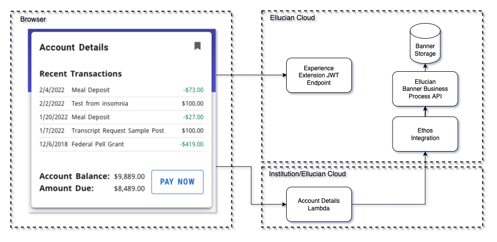

# Experience Ethos Examples - Account Details

## Account Details Extension
This set of example projects center around the Account Details extension. The extension includes a card and page that show the current user their account details and balance. The data for the card and page are acquired through the BP API (Banner Business Process API) through Ethos Integration. This example provides a starting point for other functionality. Additional data and behavior could include using a Pay Now feature that integrates with your payment provider.

For details regarding the extension see: [readme](../account-details-extension/README.md)

The interaction between the Experience card and page with Ethos is as diagramed.

## Account Details microservice

This microservice is implemented as a Serverless.com project which uses a JavaScript Lambda function in AWS. This extension makes CORS (Cross-Origin Resource Sharing) API calls to an AWS Gateway that triggers an AWS Lambda function. This Lambda function authorizes requests and calls BP API through Ethos Integration.

For details regarding the microservice see: [readme](../account-details-lambda/README.md)

Card and Page images:

 

 

Copyright 2021–2022 Ellucian Company L.P. and its affiliates.
