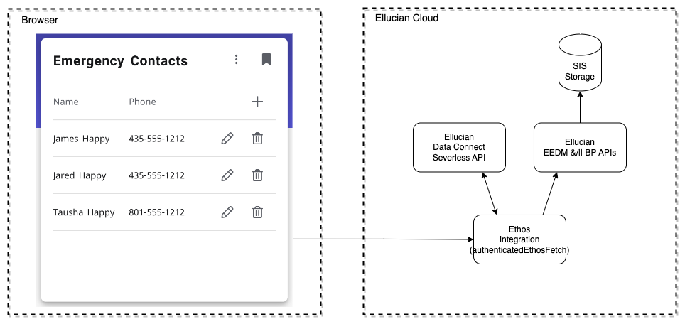

# Experience Ethos Example - Emergency Contacts

This example extension includes a card that shows the current user's emergency contacts and allows them to add, edit or remove emergency contacts and the several Data Connect Serverless API pipelines.

## Extension

This example extension includes a card that shows the current user's emergency contacts and allows them to add, edit or remove emergency contacts.

For details regarding the extension see: [readme](extension/README.md)

## Data Connect Serverless API

The dataconnect directory includes several exported Data Connect Serverless API pipelines and a readme. The Data Connect pipelines make calls to EEDM person-emergency-contacts API and for Banner, the delete operation uses the BP API emergency-contacts.

For details regarding the Data Connect API see: [readme](dataconnect/README.md)

Copyright 2021–2023 Ellucian Company L.P. and its affiliates.
