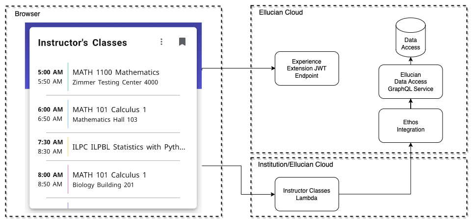

# Experience Ethos Example - Instructor Classes

This example, includes a card and page that show an instructors classes. There are two npm projects in this example, an extension and a microservice. The data for the card is acquired through the Ethos GraphQL utilizing the same resources as the Today Classes example.

Diagram of the interaction between the Experience card and Ethos.

## Instructor Classes Extension

This extension includes a card which displays a list of the classes the instructor is teaching.

For details regarding the extension see: [readme](extension/README.md)

## Instructor Classes microservice

This microservice is implemented as a Serverless.com project which uses a JavaScript Lambda function in AWS. This extension makes CORS (Cross-Origin Resource Sharing) API calls to an AWS Gateway that triggers an AWS Lambda function. This Lambda function authorizes requests and calls BP API through Ethos Integration.

For details regarding the microservice see: [readme](microservice/README.md)

Copyright 2021–2023 Ellucian Company L.P. and its affiliates.
