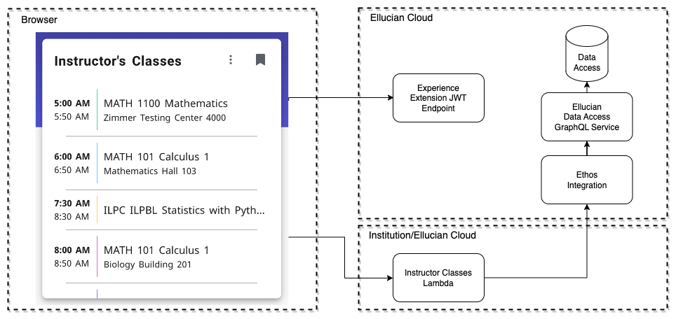

# Instructor's Classes - Lambda
This example utilizes serverless.com framework to define and deploy an AWS lambda function with AWS API Gateway as an API. The today-classes API returns a student's classes for the given date, presumably today.

The instructor-classes endpoint does the following:
1. Allows CORS calls from Experience origins.
1. Verifies and decodes the Experience Extension JWT passed from the browser side extension.
1. Calls the card server configuration endpoint on Experience to retrieve the Ethos API Key.
1. Uses two GraphQL queries to retrieve the instructor's classes (sections) and some of the class details.

Here is an interaction diagram.

# Setup

To deploy a lambda function and the associated resources using this Serverless.com project, you will need an AWS account, AWS credentials defined in your terminal of choice with sufficient permissions. A guide to AWS Credentials for Serverless can be found at https://www.serverless.com/framework/docs/providers/aws/guide/credentials/.

# Quick Start

To run the Lambda function locally in offline mode do the following

1. Open a terminal and cd to the instructor-classes/microservice directory.
1. Execute `npm install` to install all the node modules needed.
1. Create .env. Copy the sample.env file to .env and add the JWT_SECRET and EXTENSION_API_TOKEN from Experience Setup Extension Management. Other .env vars described below.
1. Execute `npm start` that will run the npm script 'npx serverless offline --stage dev'.

It will start an endpoint listening on port 3000. It will show you in a box with the GET URL. Copy this URL to use to configure the card. It will be http://localhost:3000/api

## JWT secret and extension API Token
You will need to create a JWT secret to share with the Extension Management and use in the .env file. This secret needs to be between 32 to 50 characters.

Once the extension is uploaded, an Extension API Token needs to be generated. Use Experience Setup Extension Management and edit the extension. Enter the JWT secret and then click on the "GENERATE API TOKEN" button. This will generate a Token that the server side can use to call back to Experience and get card configuration. Copy the generated token and add it to the .env file as the value for EXTENSION_API_TOKEN

## Other .env values for AWS Tags
The other vars listed in sample.env can be used for tagging the AWS resources. See the serverless.yml blocks for tags. You can use them or remove them as desired.

## Configure Card

Please follow the readme for the [extension](../extension/README.md) to build and deploy the cards.

Login to Experience as a user with permission to use Card Management. Locate the Instructor's Classes card. This card has two items to configure on step 3.

1. Lambda Instructor Classes URL - set this to the URL shown when starting the offline serverless
1. Ethos API Key - set this to an Ethos API key that has access to the GraphQL resources as described in [Ethos Guide](../docs/ethos-guide.md).

## CORS and Serverless Offline

When running this the first time, serverless offline won't properly return CORS headers if you use the allowedOrigins block. The work around it to set the httpApi.cors value in serverless.yml to 'true' initially or always when using serverless offline (running locally). When you deploy to AWS, it is recommended you use the commented out cors block to be more restrictive of what websites can access your Lambda endpoints.

Copyright 2021–2023 Ellucian Company L.P. and its affiliates.
