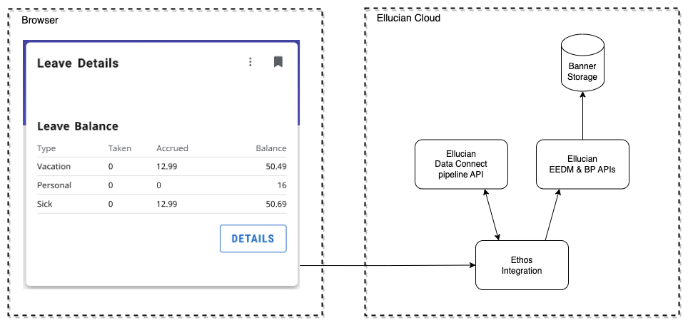

# Experience Ethos Example - Leave Balance Data Connect

This example extension retrieves data through the use of a Data Connect Serverless API. The API is created by using the Data Connect designer in Experience. The API pipeline source is included in this directory, in a file called ethos-example-account-details.json

The architecture of the Experience extension is as diagrammed.

## Leave Balance Extension

This example extension includes a card and page that show the current user, an employee their leave balance. The data for the card and page are acquired through the BP API (Banner Business Process API) through Ethos Integration.

For details regarding the extension see: [readme](extension/README.md)

## Data Connect API

The dataconnect directory includes an exported Data Connect API pipeline and a readme. The Data Connect pipeline makes a call to EEDM persons API and BP API employee-leave-balances through Ethos Integration.

For details regarding the Data Connect API see: [readme](dataconnect/README.md)

Copyright 2021–2023 Ellucian Company L.P. and its affiliates.
