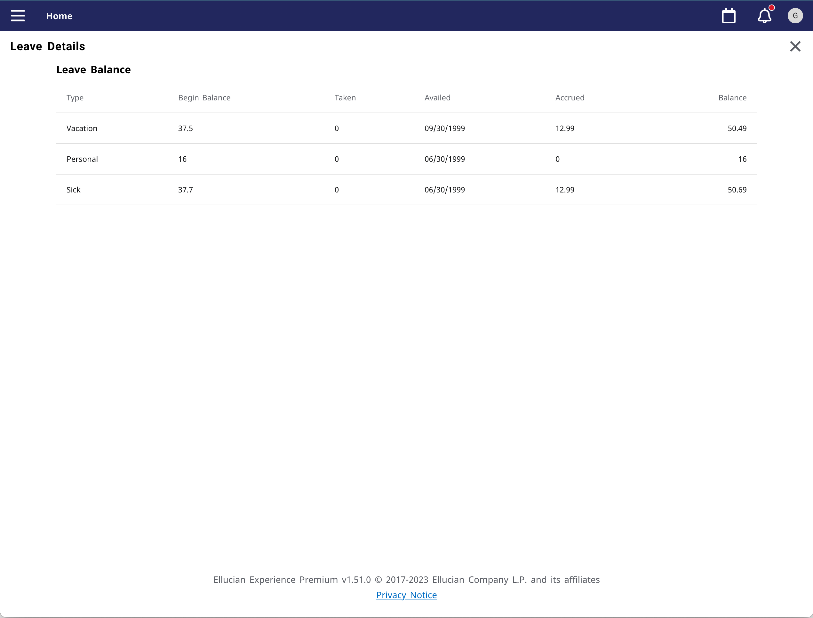

# Leave Balance Data Connect Extension
## The Extension
This example extension includes a card and page that show the current user, an employee their leave balance. The data for the card and page are acquired through the BP API (Banner Business Process API) through Ethos Integration.

The interaction between the Experience card and page with Ethos is as diagrammed.

 

To upload and use this extension you will need to do the following from the leave-balance/extension directory:

* Run 'npm install'
* Set the "publisher" in extension.js. Should be the name of your institution or organization.
* Copy sample.env to .env. Adding your upload token and uncommenting and editing the other vars as appropriate.
* Run one of the deploy scripts in package.json. Such as "watch-and-upload" or "deploy-dev".
* Use Experience Setup to enable or verify your new extension is enabled, and is associated with an Environment.

### Configure the card
Login to Experience as a user with permission to use Experience Configuration -> Card Management. Locate the Leave Balance Data Connect card. This card has two items to configure.

1. Pipeline API - The name of your pipeline as created in Data Connect as a serverless API.
1. Ethos API Key.

 
The page view displays all the leave balances with more details.

## Leave Balance Data Connect API

This example makes use of a Data Connect API.

See the readme for details [readme](../dataconnect/README.md)

 

Copyright 2021–2023 Ellucian Company L.P. and its affiliates.
