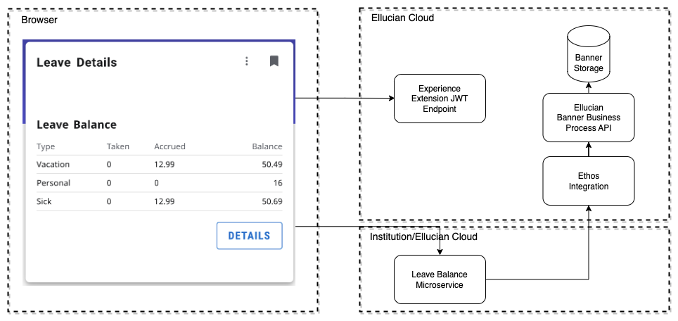

# Leave Balance Extension
## The Extension
This example extension includes a card and page that show the current user, employee, their leave balance. There are two npm projects in this example, an extension and a microservice. The data for the card and page are acquired through the BP API (Banner Business Process API) through Ethos Integration.

The interaction between the Experience card and page with Ethos is as diagramed.

 

To upload and use this extension you will need to do the following from the leave-balance/extension directory:

* Run 'npm install'
* Set the "publisher" in extension.js. Should be the name of your institution or organization.
* Copy sample.env to .env. Adding your upload token and uncommenting and editing the other vars as appropriate.
* Run one of the deploy scripts in package.json. Such as "watch-and-upload" or "deploy-dev".
* Use Experience Setup to enable or verify your new extension is enabled, is associated with an Environment, has a shared secret, and generate and copy an Extension API Token.

Note: it is recommened that you set your JWT secret in the .env file as EXPERIENCE_EXTENSION_SHARED_SECRET. This will avoid having to manually set the JWT secret in Experience Setup for each version.

## Leave Balance microservice

This example makes CORS (Cross-Origin Resource Sharing) API calls to an AWS Gateway that triggers an AWS Lambda function. This Lambda function authorizes requests and calls Ethos Integration.

See the readme for details [readme](../microservice/README.md)

 

Copyright 2021–2023 Ellucian Company L.P. and its affiliates.
