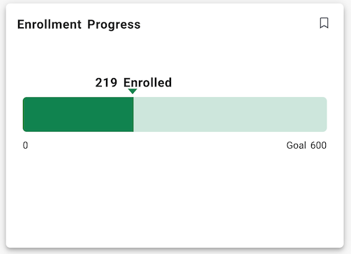

# Experience Ethos Example - No Code Data Template Cards

This example show how you can add cards to Experience with no code that display data from Ethos APIs. This example includes two Data Connect Serverless API pipelines.

The Cards:

## Cumulative GPA - Big Number Card

This card shows a student their cumulative GPA. 

### Data Connect Serverless API

The data-connect directory includes a pipeline JSON named ethos-example-get-cumulative-gpa.json This file will be used to create the Serverless API endpoint for the card.

#### Ensure Ethos access to the necessary resources

Follow the [Ethos Guide](./docs/ethos-guide.md) to ensure the needed resources are available and you have an API Key that can be used to access them.

#### Create the Serverless API pipeline

You will need to create the API in your tenant by doing the following:
Note: the prefix is needed to make a globally unique package and pipeline names. It is recommended that you use your institution's domain name part or your tenant alias for the prefix. For instance, for ellucian.edu, I could use ellucian as my prefix.

1. Login to Experience in a tenant that has the Data Connect - Integration Designer configured for use.
1. Launch the Integration Designer page from the card by selecting "View all results".
1. Create a package as needed. For example - \<prefix>-experience-ethos-examples
1. Create a pipeline using the "+PIPELINE" button.
1. Pick Pipeline Type - API
1. Enter a pipeline name. For example - \<prefix>-ethos-example-get-cumulative-gpa
1. Pick the GET HTTP Method.
1. Select Authentication Type - User Token
1. Click on "SAVE"
1. Click on the Dropdown next to the GET near the the top of the screen and pick "Import Pipeline".
1. Find the ethos-example-get-cumulative-gpa.json in the data-connect folder and click on "Import"
1. Click on "SAVE"
1. Click on "PUBLISH", then after it shows you the version options, click on "PUBLISH". It will take some time to publish.
1. The API is ready to set up permissions

#### Configure Experience Permissions

The Data Connect Serverless API is published and ready to use once permissions are assigned.

Do the following;

1. Login to Experience Setup. Initially, you will probably be doing this in your Test tenant.
1. Click on "PERMISSIONS" in the top navigation bar in Experience Setup. Pick "DATA CONNECT".
1. Select "APIs" in the left navigation. Then your package. For example \<prefix>-experience-ethos-examples
1. Find your API and select it. For example - \<prefix>-ethos-example-get-cumulative-gpa
1. In the right pane select the Role(s) and User(s) as desired to grant the Execute permission for these users. For this example, you would want to grant the Execute permission to a role that includes all students. This will allow all students to use the No-Code Big Number Card to view their cumulative GPA through the execution of this API.

The API is now ready to use.

#### Add a Big Number Card to Experience

Now that the Serverless API is ready, let's setup the no code Big Number card as follows:

1. Login to Experience Dashboard as a user that has Dashboard Configuration -> Card Management -> manage permission.
1. Pick Configuration from the left navigation menu.
1. Click on the "ADD CARD" button.
1. Select the Big Number template
1. Give it an appropriate title, such as Cumulative GPA. Then add the required description and card tag(s). Optionally place it in the Academic category.
1. Click on "NEXT" to go to step 2
1. Now we need to pick your API. Click on the "SELECT API" button. This will open a full page dialog.
1. Search for you API <prefix>-ethos-example-get-cumulative-gpa and pick it.
1. You will now see the details regarding the API. Note the details. You can expand the documentation for the API.
1. Click on "SELECT GET" to choose this API for use in the card. This will take you back to step 2
1. You will need to supply an Ethos API key. This API key needs to have access to the underlying Ethos API, namely student-grade-point-averages
1. For the Big Number Value, enter the mustache expression {{gpa}} and GPA for the label. At this point the Preview should render a GPA if your user is a student and you have GPA data in the ERP.
1. Got to step 3 and pick the role(s) that should be able to see the card. For example student
1. Click the "FINISH" button and you are done.

## Enrollement Progress - Progress Card

This card shows a terms total enrollement and a Goal for enrollment

### Data Connect Serverless API

The data-connect directory includes a pipeline JSON named ethos-example-get-enrolled-count.json This file will be used to create the Serverless API endpoint for the card.

#### Ensure Ethos access to the necessary resources

Follow the [Ethos Guide](./docs/ethos-guide.md) to ensure the needed resources are available and you have an API Key that can be used to access them.

#### Create the Serverless API pipeline

You will need to create the API in your tenant by doing the following:
Note: the prefix is needed to make a globally unique package and pipeline names. It is recommended that you use your institution's domain name part or your tenant alias for the prefix. For instance, for ellucian.edu, I could use ellucian as my prefix.

1. Login to Experience in a tenant that has the Data Connect - Integration Designer configured for use.
1. Launch the Integration Designer page from the card by selecting "View all results".
1. Create a package as needed. For example - \<prefix>-experience-ethos-examples
1. Create a pipeline using the "+PIPELINE" button.
1. Pick Pipeline Type - API
1. Enter a pipeline name. For example - \<prefix>-ethos-example-get-enrolled-count
1. Pick the GET HTTP Method.
1. Select Authentication Type - User Token
1. Click on "SAVE"
1. Click on the Dropdown next to the GET near the the top of the screen and pick "Import Pipeline".
1. Find the ethos-example-get-term-enrolled-count.json in the data-connect folder and click on "Import"
1. Click on "SAVE"
1. Click on "PUBLISH", then after it shows you the version options, click on "PUBLISH". It will take some time to publish.
1. The API is ready to set up permissions

#### Configure Experience Permissions

The Data Connect Serverless API is published and ready to use once permissions are assigned.

Do the following;

1. Login to Experience Setup. Initially, you will probably be doing this in your Test tenant.
1. Click on "PERMISSIONS" in the top navigation bar in Experience Setup. Pick "DATA CONNECT".
1. Select "APIs" in the left navigation. Then your package. For example \<prefix>-experience-ethos-examples
1. Find your API and select it. For example - \<prefix>-ethos-example-get-term-enrolled-count
1. In the right pane select the Role(s) and User(s) as desired to grant the Execute permission for these users. For this example, you would want to grant the Execute permission to a role that includes your target audience. This will allow user with this role to use the No-Code Progress card to view the term enrollment count through the execution of this API.

The API is now ready to use.

#### Add a Big Number Card to Experience

Now that the Serverless API is ready, let's setup the No-Code Progress card as follows:

1. Login to Experience Dashboard as a user that has Dashboard Configuration -> Card Management -> manage permission.
1. Pick Configuration from the left navigation menu.
1. Click on the "ADD CARD" button.
1. Select the Progress template
1. Give it an appropriate title, such as Enrollment Progress. Then add the required description and card tag(s). Optionally place it in the an appropriate category.
1. Click on "NEXT" to go to step 2
1. Now we need to pick your API. Click on the "SELECT API" button. This will open a full page dialog.
1. Search for you API <prefix>-ethos-example-get-term-enrollment-count and pick it.
1. You will now see the details regarding the API. Note the details. You can expand the documentation for the API.
1. Click on "SELECT GET" to choose this API for use in the card. This will take you back to step 2
1. You will need to supply an Ethos API key. This API key needs to have access to the underlying Ethos API, namely term-enrollments
1. Now pick a Type for the graph. The choices are Gauge or Linear. Also pick a color for the graph
1. Enter a start value, for example 0 as well as a display name if desired, which can also be 0.
1. Enter a current value that uses a mustache expression to pull the value from the API response. In our case this is {{enrolled}}
1. Also Enter a current display value. For example "{{enrolled}} Enrolled" will include the value in the label.
1. Enter an end value. This could come from the API as a mustache expression or in this example would be hand entered as the target for the enrollment. Enter a number value. For the display name use something like "Goal XXX"
1. If desired you can enter a start and end date for the progress
1. Got to step 3 and pick the role(s) that should be able to see the card. This should be a role for the target audiance of this card
1. Click the "FINISH" button and you are done.

Copyright 2021–2025 Ellucian Company L.P. and its affiliates.
