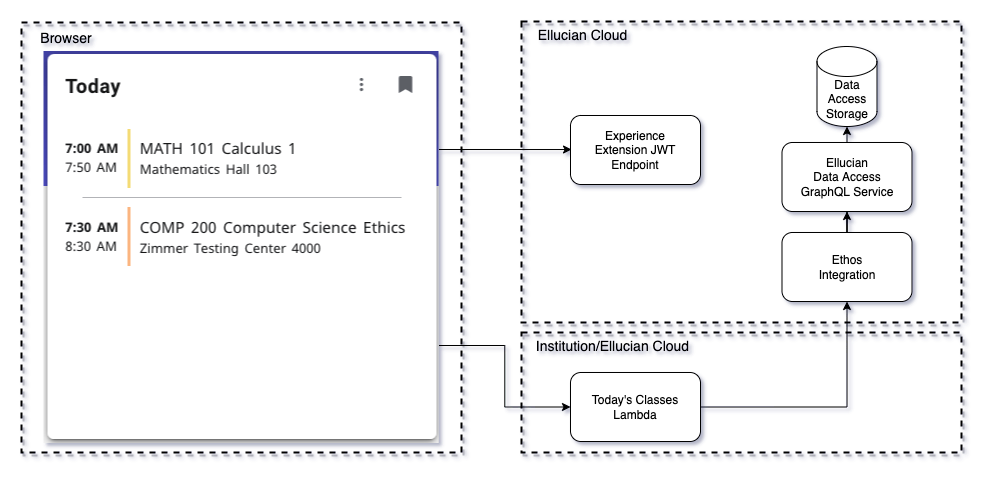

# Today's Classes Extension
This example extension includes cards that show today's classes for the current user. This simple example provides a starting point for other functionality. Additional data and behavior could include more class details, grades, and even third-party integrations with a way-finding provider to find your way to class.

The UI content is primarily provided by the component in src/components/TodayClasses.jsx. This component is wrapped with a React Context that is parameterized by the several cards. Each card employs a different way to retrieve the data through Ethos Integration from the ERP.

This extension included today classes retrieval using the following methods:
1. Experience GraphQL Proxy for extensions
1. Lambda microservice which uses Ethos GraphQL API
1. Node microservice which uses Ethos EEDM Proxy API

## Experience GraphQL Proxy for extensions

Experience provides a proxy to Ethos Integration GraphQL API. See https://resources.elluciancloud.com/bundle/ellucian_experience_acn_use/page/t_extension_graphql_requests.html. This provides an extension card or page the ability to make Ethos Integration GraphQL queries through the Experience server. Experience authorizes the queries and proxies the request to Ethos Integration using Experience's Ethos API Key. Experience ensures that queries to resources that can be queried by persons, use a person filter. This ensures the Experience user only gains access to only their data.

In this extension, there are two GraphQL queries defined in extension.js. The first, today-sections, is used to find the sections the user is registered which span today's date. The second, instructional-events-by-section, is used to retrieve the recurrence pattern for event times and the location of each. This is invoked for each section. The recurrence pattern is then used to determine which classes meet today.

This method of retrieving today's classes utilizes the getEthosQuery property that Experience makes available to extensions. getEthosQuery is an asynchronous function that requires a query ID and any needed properties to execute the GraphQL query. Note the user/person ID is not passed from the browser. The query today-sections utilizes the automatically provided personId from the Experience server that is pulled from the user's session.

Ethos GraphQL leverages the data stored in Ellucian Data Access. The Ethos Integration resources and setup details are in the [Ethos Guide](../docs/today-classes-ethos-guide.md).
 

## Lambda microservice which uses Ethos GraphQL API

This example makes CORS (Cross-Origin Resource Sharing) API calls to an AWS Gateway that triggers an AWS Lambda function. This Lambda function authorizes requests, calls Ethos Integration GraphQL API, and filters data for the current user.

This example will use the same GraphQL queries and data loading requirements as were used with the Experience GraphQL Proxy above. The logic to filter to a list of just today's classes will be implemented in the Lambda function. This reduces the business logic in the browser just sorting as needed for display.

The card in this case makes use of the getExtensionJwt property from Experience. This is an asynchronous function that generates a short-lived Experience Extension JWT token that is signed with a secret. This same secret is used by the lambda microservice to validate the JWT and extract the current user's ID.

The Lambda function is defined as a [serverless.com](https://serverless.com) framework node project. This is found in the same repository. See the Lambda [readme](../today-classes-lambda/README.md)

 

 

## Node microservice which uses Ethos EEDM Proxy API

This example makes CORS API calls to a node express application that authorizes requests, calls Ethos Integration using EEDM resources proxy API, and filters data for the current user.

This example demonstrates how to use EEDM (Ellucian Ethos Data Model) resources to retrieve the ERP data to show today's classes. The EEDM is a data-oriented API that requires more round trips to retrieve the data than when employing GraphQL. This approach results in slower data retrieval but doesn't have the dependency on getting the needed resources loaded into Ellucian Data Access.

The card in this case makes use of the getExtensionJwt property from Experience. This is an asynchronous function that generates a short-lived Experience Extension JWT token that is signed with a secret. This same secret is used by the node application to validate the JWT and extract the current user's ID.

The node application also uses Experience Extension JWT to authenticate and authorize access to the data for the current user. It then queries the resources as needed to retrieve the same data as the GraphQL examples.

The node application is defined as an express node application. This is found in the same repository. See the Node [readme](../today-classes-node/README.md)

 

Copyright 2021–2022 Ellucian Company L.P. and its affiliates.
