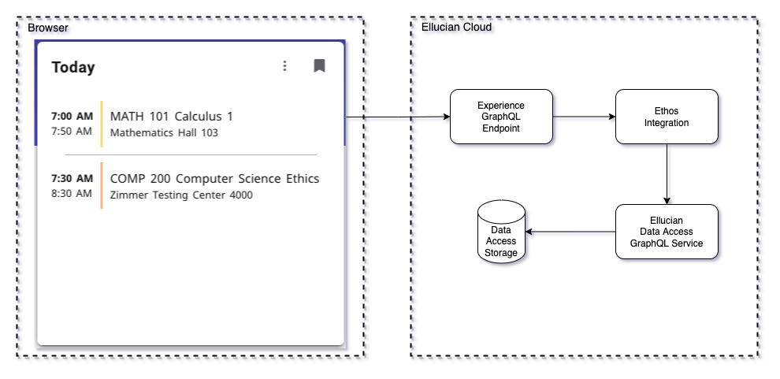

# Experience Ethos Example - Today's Classes GraphQL Proxy

This example is part of a suite of examples that illustrate multiple methods to access institution data through Ethos from Experience cards and pages. This use case is a card that displays the student's classes that meet today. This example fetches the Ethos data utilizing the Experience GraphQL proxy. Using Experience's GraphQL proxy avoids the need to deploy a microservice. The efficiency of GraphQL also reduces the round trips to Ethos by returning graphs of objects. There is some extra setup effort involved in loading the needed resources into Ellucian Data Access and authorizing the Ethos Application to use those resources.

Diagram of the interaction between the Experience card and Ethos.

## Today's Classes Extension

This extension includes a card that displays a student's classes that meet today.

For details regarding the extension see: [readme](extension/README.md)

Copyright 2021–2023 Ellucian Company L.P. and its affiliates.
