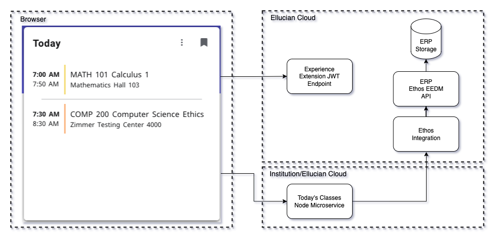

# Today's Classes Node Extension
This example extension includes a card that shows the student their classes that meet today. The data for the card is fetched through a Node microservice. The microservice makes requests to Ethos Integration to get EEDM resources.

 

 
To upload and use this extension you will need to do the following from the today-classes-node/extensions directory:

* Run 'npm install'
* Set the "publisher" in extension.js. This can be the name of your institution or organization.
* Copy sample.env to .env. Adding your upload token and uncommenting and editing the other vars as appropriate.
* Run one of the deploy scripts in package.json. Such as "watch-and-upload" or "deploy-dev".
* Use Experience Setup to ensure your extension is enabled and is associated with an Environment. Also, ensure it has a shared secret. Then generate or copy an Extension API Token.
* Use Experience -> Configuration -> Card Management to set up the card to be available in Experience. This includes configuring the microservice URL and the Ethos API Key. The microservice URL is configurable to allow you to run the Node application locally or deployed.

The microservice is detailed in the [microservice README](../microservice/README.md).

 

Copyright 2021–2023 Ellucian Company L.P. and its affiliates.
